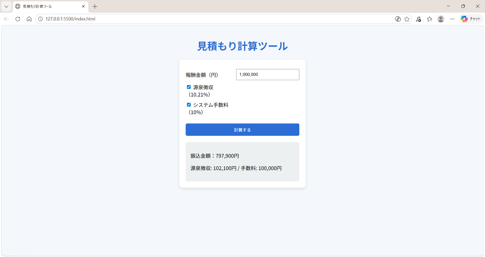

# フリーランス向け見積もり計算ツール

## 概要

報酬金額から源泉徴収およびシステム手数料を差し引いた「振込金額」を計算するWebアプリです。
フリーランス業務での見積もりや実際の入金額の把握を目的として作成しました。

---

## 機能

* 報酬金額の入力
* 源泉徴収（10.21%）の計算
* システム手数料（10%）の計算
* 振込金額の自動算出
* 控除内訳の表示（源泉徴収 / 手数料）
* 入力値のフォーマット（カンマ区切り）
* エラーメッセージ表示
* レスポンシブ対応（スマートフォン対応）

---

##  使用技術

* HTML
* CSS
* JavaScript（Vanilla JS）

---

## 工夫した点

* 入力時のUXを改善するため、フォーカス時はカンマを削除し、フォーカス外で自動整形する仕様にしました。
* `alert`ではなく画面内にエラーメッセージを表示し、ユーザー体験を向上させました。
* 関数を分離することで、処理の見通しと保守性を意識しました。
* スマートフォンでも使いやすいようにレスポンシブデザインを実装しました。

---

## 使い方

1. 報酬金額を入力
2. 必要に応じてチェックボックスを選択
3. 「計算する」ボタンをクリック
4. 振込金額と内訳が表示されます

---

##  計算仕様

* 源泉徴収：10.21%
* システム手数料：10%
* 両方とも「報酬金額」を基準に計算しています

---

##  今後の改善予定

* リアルタイム計算（ボタン不要）
* 手数料計算の順序切り替え機能
* 入力内容の保存機能（localStorage）

---

##  画面イメージ

---

##  作者
- 名前：yuya-oshita-0702
- GitHub：https://github.com/yuya-oshita-0702
- 制作背景：
  フリーランスとして活動する際に、実際の振込金額を簡単に把握できるツールが欲しいと考え作成しました。
  
---
